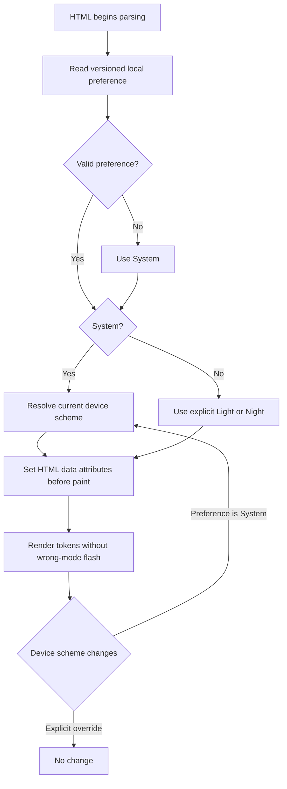

# Colour modes and animation

- Status: Implemented
- Audience: Designers, frontend developers and accessibility reviewers
- Owner: Design-system maintainer
- Last updated: 2026-08-30

## Resolution model

The anonymous preference key is `fsm:colour-mode:v1`. Missing or invalid values resolve to System. Explicit Light or Night overrides remain until changed. System responds live to `prefers-color-scheme` changes. Nothing is written to D1 or transmitted to the server.

## Pre-paint implementation

An inline script in the document head reads local storage and applies `data-mode-preference` plus `data-resolved-mode` before styled content paints. The longer controller then binds all visible controls, persists choices and listens to the media query. First-paint transitions are disabled and removed after initialisation.

## Animation specification

- Entrances: opacity and at most 14px vertical transform, 360ms.
- Interactions: transform/background/border, 140–220ms.
- Garden hero: one-time SVG stroke draw and block settle.
- Geometry hero: one-time shape settle.
- No delayed LCP text, marquee, scroll-jacking, flashing, large parallax or infinite decoration.
- `prefers-reduced-motion: reduce` collapses durations to effectively zero, restores revealed content and disables smooth scrolling.

## Accessibility contract

The three choices form a labelled button group. `aria-pressed` reflects the persisted preference, not merely the currently resolved colour. Buttons are keyboard reachable and have explicit tooltips/titles; focus styling is not removed.
