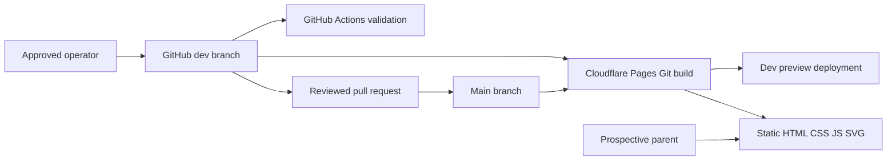
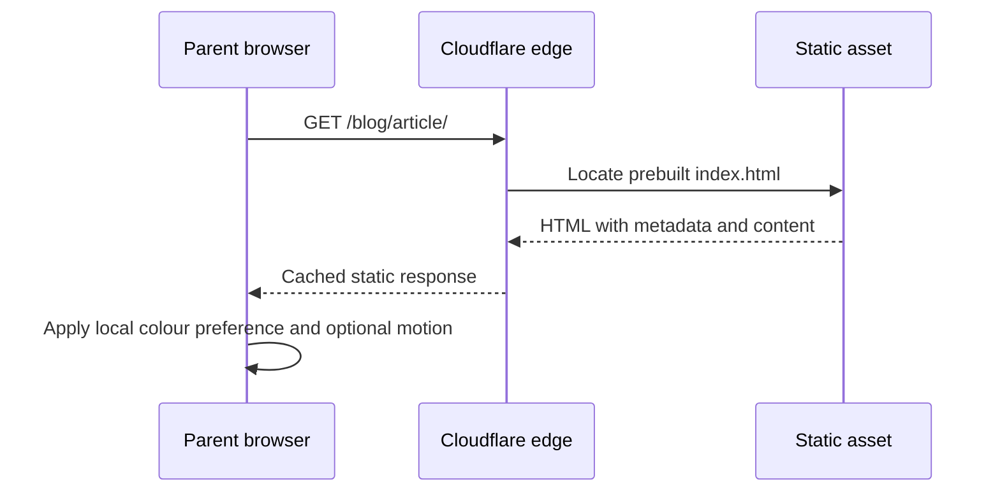

# High-level design

- Status: Static architecture implemented and deployed to both Pages showcases
- Audience: School owner, maintainers and reviewers
- Owner: Architecture owner
- Last updated: 2026-08-31

## System context

GitHub is the source of content, revision history and approval. Astro compiles Markdown and components into static files. Cloudflare Pages builds from Git and serves those files globally. No request-time application, database or identity service participates.

## Public request flow

JavaScript enhances colour selection and entrance motion only. Links, text, SEO metadata and journal content remain useful when JavaScript is unavailable.

## Theme builds

Garden and Geometry are separate Pages projects connected to the same repository. Each supplies a different `SITE_THEME` build variable. Content schemas and routes are shared; only visual tokens and motifs vary.
