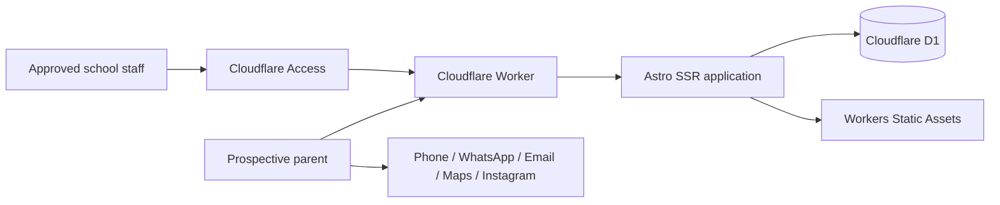
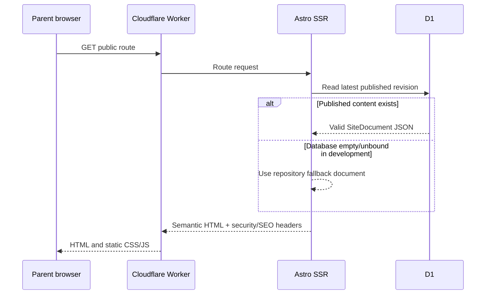

# High-level design

- Status: Implemented baseline
- Audience: Technical maintainers, security reviewers and school owner
- Owner: Solution architect
- Last updated: 2026-08-30

## System context

## Containers and boundaries

The Worker is the public origin and application runtime. Astro renders semantic pages and API routes. Static Assets serves compiled CSS, browser scripts and fonts referenced by the application; the site ships no raster image assets. D1 stores one current draft, immutable published revisions and audit events. Cloudflare Access is the identity and policy boundary for `/admin*` and `/api/admin*`.

## Public request flow

## Service principles

There is no separate origin server, object store, media pipeline, marketing tracker or form-processing service. This deliberately small boundary reduces cost, maintenance, privacy exposure and attack surface.
