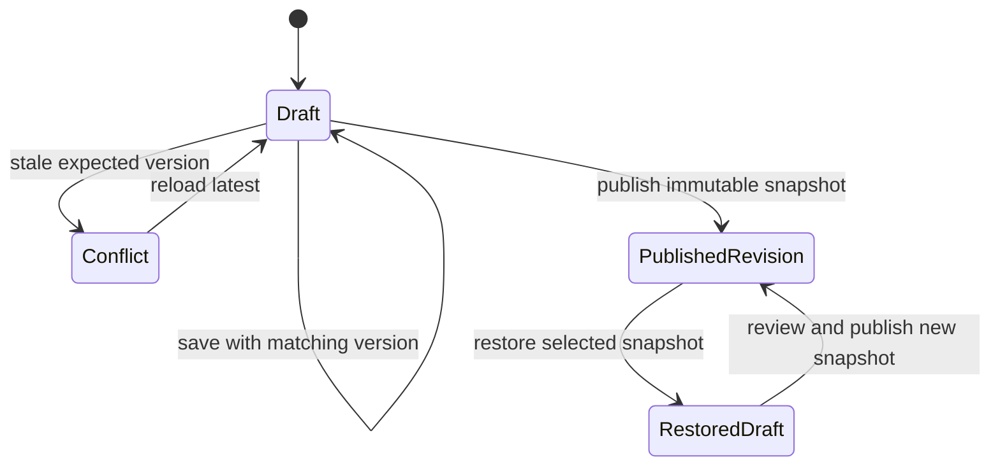

# Data model and API contracts

- Status: Implemented
- Audience: Developers, database maintainers and security reviewers
- Owner: Application maintainer
- Last updated: 2026-08-30

## D1 schema

`site_drafts` contains exactly one row (`id = 1`) with validated JSON, monotonic version, editor and timestamp, plus the most recently published revision identifier. `site_revisions` contains immutable UUID-keyed documents and unique revision numbers. `audit_log` records actor, action, bounded JSON details and timestamp. See [`migrations/0001_content.sql`](../migrations/0001_content.sql).

## SiteDocument

The strict TypeScript/Zod document contains `settings`, `pages`, exactly four `programmes`, up to five `announcements`, and `seo`. Strings are trimmed and length-bounded; emails and URLs are validated. Unknown HTML cannot be inserted because the schema accepts plain strings and templates escape output.

## API contracts

| Endpoint | Request | Success | Important errors |
|---|---|---|---|
| `GET /api/admin/draft` | Access identity | Draft record | 401, 503 |
| `PUT /api/admin/draft` | `{document, version}` | Updated draft/version | 403, 409, 422, 503 |
| `POST /api/admin/publish` | `{version}` | `201 {revision}` | 403, 409, 422, 503 |
| `GET /api/admin/revisions` | Access identity | `{revisions}` newest first | 401, 503 |
| `POST /api/admin/revisions/:id/restore` | `{version}` | New draft/version | 403, 409, 422, 503 |

All protected responses use `Cache-Control: no-store`. Mutation requests must be same-origin when an Origin header is present.

## State transitions

## Transaction notes

D1 `batch()` groups revision insert, published-pointer update and publish audit. Optimistic draft writes prevent lost updates. A unique revision number prevents publishing the same draft version twice.
