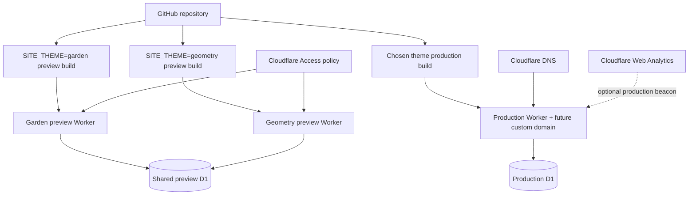
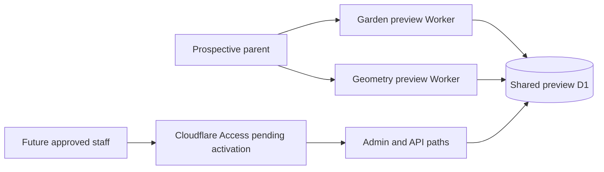

# Cloudflare infrastructure

- Status: Preview Workers and D1 provisioned; Access and production resources pending
- Audience: Cloudflare administrators, DevOps maintainers and school owner
- Owner: Infrastructure maintainer
- Last updated: 2026-08-30

## Deployment topology

## Resources

- Garden preview Worker: `first-step-montessori-garden-preview` at
  `https://first-step-montessori-garden-preview.harshu-1982.workers.dev`.
- Geometry preview Worker: `first-step-montessori-geometry-preview` at
  `https://first-step-montessori-geometry-preview.harshu-1982.workers.dev`.
- Shared APAC preview D1 database: `first-step-montessori-preview`, binding
  `DB`; migration `0001_content.sql` is applied remotely.
- One future production Worker and separate production D1 database.
- Workers Static Assets for compiled CSS and browser code.
- Future Cloudflare Access applications/policies covering `/admin*` and
  `/api/admin*` on every hostname. The account currently requires Zero Trust
  plan activation before an application can be created.
- Cloudflare DNS and Web Analytics only after a domain is chosen.

Astro sessions are explicitly disabled because the application has no session state, avoiding an unnecessary KV namespace. Image handling is set to passthrough because version one ships no photographic assets, avoiding an unnecessary Cloudflare Images binding.

## Current request flow

Both public previews are live and intentionally return `noindex,nofollow` plus
a `robots.txt` policy that disallows crawling. Unauthenticated admin requests
return `401`; a live forged-header test also returned `401` on both Workers.

## Configuration safety

[`wrangler.jsonc`](../wrangler.jsonc) is the source of truth for Worker names,
environment variables and D1 bindings. The preview D1 resource identifier is
committed because it is a non-secret binding identifier; possession of it does
not grant database access. Cloudflare account IDs, OAuth/API tokens, private
email allowlists, Access credentials and analytics tokens must remain in
Cloudflare or approved secret storage.

Astro emits a redirected deployment configuration under `dist/server`. A plain
`wrangler deploy --env ...` therefore used the top-level Worker name during the
first provisioning attempt. The checked-in deployment scripts explicitly pass
`--name` so Garden and Geometry cannot overwrite one another. The accidental
top-level Worker created during discovery was deleted after both named previews
were verified.

## Provisioning sequence

1. Completed: authenticate Wrangler using the owner's local OAuth session.
2. Completed: create the shared preview D1 database in APAC and bind both
   preview environments.
3. Completed: apply migration `0001_content.sql` remotely.
4. Completed: deploy and verify both named preview Workers.
5. Pending owner authorization: activate a Cloudflare Zero Trust plan and
   configure named-user Access policies.
6. Pending school decision: choose the production theme and domain.
7. Pending production provisioning: create a separate production D1 database,
   deploy the selected Worker and attach DNS.

Use the current [Astro Workers guide](https://developers.cloudflare.com/workers/framework-guides/web-apps/astro/) and [D1 Worker API](https://developers.cloudflare.com/d1/worker-api/) during provisioning because platform syntax and limits can change.
