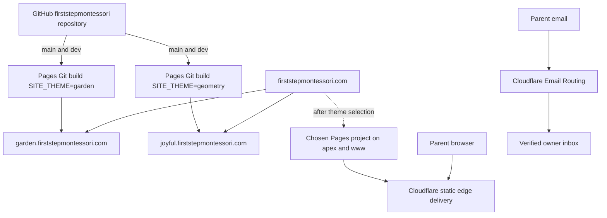

# Cloudflare infrastructure

- Status: Pages custom subdomains and Email Routing DNS are active; email rule and legacy Worker removal pending
- Audience: Cloudflare administrators, maintainers and school owner
- Owner: Infrastructure maintainer
- Last updated: 2026-08-31

## Deployment topology

## Pages projects

| Setting | Garden | Geometry |
|---|---|---|
| Project | `first-step-montessori-garden` | `first-step-montessori-geometry` |
| Repository | `firststepmontessori/firststepmontessori` | Same |
| Production branch | `main` | `main` |
| Preview branch | `dev` | `dev` |
| Build command | `npm run build` | `npm run build` |
| Output directory | `dist` | `dist` |
| `SITE_THEME` | `garden` | `geometry` |
| `SITE_ENV` before selection | `preview` | `preview` |
| Custom showcase origin | `https://garden.firststepmontessori.com` | `https://joyful.firststepmontessori.com` |
| Pages fallback | `https://first-step-montessori-garden.pages.dev` | `https://first-step-montessori-geometry.pages.dev` |

Each production build uses its matching custom showcase origin as `PUBLIC_SITE_URL`. Both keep `SITE_ENV=preview`, so the temporary showcases remain `noindex,nofollow`. After selection, attach `firststepmontessori.com` and `www.firststepmontessori.com` to the chosen project, set its production environment to `SITE_ENV=production`, and retain `dev` previews as noindex.

## Interconnection

The Cloudflare Workers & Pages GitHub App is authorized only for `firststepmontessori/firststepmontessori` and starts builds on `main` and the allowlisted `dev` preview branch. GitHub Actions independently validates the same commit but does not deploy and stores no Cloudflare token. Pages reads `_headers` and `_redirects` from the build output. Cloudflare DNS maps each temporary theme subdomain to its Pages project. Email Routing, once activated, receives mail for the public school alias and forwards it to a separately verified inbox; the private destination is not stored in GitHub.

## Services deliberately absent

No Pages Functions, application Workers, D1, KV, R2, Access, Images, deploy hooks or runtime secrets are required. Cloudflare Email Routing is an edge mail-forwarding service rather than application runtime. Its domain DNS records were enabled on 2026-08-31; no public alias rule will be created until the destination mailbox is explicitly supplied and verified. Optional Web Analytics may be enabled only after school approval.

## Legacy resource cutover

Account inventory found the former Workers `first-step-montessori-garden-preview` and `first-step-montessori-geometry-preview`; they remain pending explicit deletion approval. The D1 inventory reported zero databases, so there is no `first-step-montessori-preview` database to export or delete. GitHub inventory found no repository, environment or organization Actions secrets. Both Pages replacements have passed live verification.

Use current [Pages Git integration](https://developers.cloudflare.com/pages/configuration/git-integration/github-integration/), [custom-domain guidance](https://developers.cloudflare.com/pages/configuration/custom-domains/), [branch controls](https://developers.cloudflare.com/pages/configuration/branch-build-controls/) and [Email Routing setup](https://developers.cloudflare.com/email-service/get-started/route-emails/) when provisioning.
