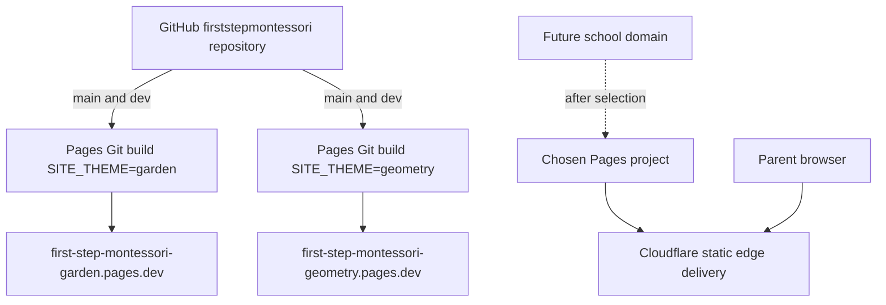

# Cloudflare infrastructure

- Status: Both Git-integrated Pages projects provisioned and verified; legacy Workers pending removal
- Audience: Cloudflare administrators, maintainers and school owner
- Owner: Infrastructure maintainer
- Last updated: 2026-08-31

## Deployment topology

## Pages projects

| Setting | Garden | Geometry |
|---|---|---|
| Project | `first-step-montessori-garden` | `first-step-montessori-geometry` |
| Repository | `firststepmontessori/firststepmontessori` | Same |
| Production branch | `main` | `main` |
| Preview branch | `dev` | `dev` |
| Build command | `npm run build` | `npm run build` |
| Output directory | `dist` | `dist` |
| `SITE_THEME` | `garden` | `geometry` |
| `SITE_ENV` before selection | `preview` | `preview` |
| Public origin | `https://first-step-montessori-garden.pages.dev` | `https://first-step-montessori-geometry.pages.dev` |

Set `PUBLIC_SITE_URL` to each Pages origin during showcase. After selection, set the chosen production environment to `SITE_ENV=production` and the approved custom-domain origin; keep branch previews as Preview/noindex.

## Interconnection

The Cloudflare Workers & Pages GitHub App is authorized only for `firststepmontessori/firststepmontessori` and starts builds on `main` and the allowlisted `dev` preview branch. GitHub Actions independently validates the same commit but does not deploy and stores no Cloudflare token. Pages reads `_headers` and `_redirects` from the build output. DNS will point the future domain to the selected Pages project.

## Services deliberately absent

No Pages Functions, Workers, D1, KV, R2, Access, Images, deploy hooks or runtime secrets are required. Optional Web Analytics may be enabled only after school/domain approval.

## Legacy resource cutover

Account inventory found the former Workers `first-step-montessori-garden-preview` and `first-step-montessori-geometry-preview`; they remain pending explicit deletion approval. The D1 inventory reported zero databases, so there is no `first-step-montessori-preview` database to export or delete. GitHub inventory found no repository, environment or organization Actions secrets. Both Pages replacements have passed live verification.

Use current [Pages Git integration](https://developers.cloudflare.com/pages/configuration/git-integration/github-integration/) and [branch controls](https://developers.cloudflare.com/pages/configuration/branch-build-controls/) when provisioning.
