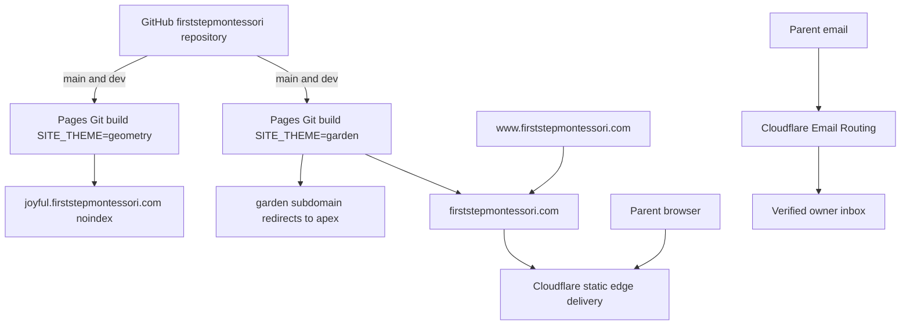

# Cloudflare infrastructure

- Status: Garden production domain, SSL and canonical redirects active; Geometry remains noindex
- Audience: Cloudflare administrators, maintainers and school owner
- Owner: Infrastructure maintainer
- Last updated: 2026-08-31

## Deployment topology

## Pages projects

| Setting | Garden | Geometry |
|---|---|---|
| Project | `first-step-montessori-garden` | `first-step-montessori-geometry` |
| Repository | `firststepmontessori/firststepmontessori` | Same |
| Production branch | `main` | `main` |
| Preview branch | `dev` | `dev` |
| Build command | `npm run build` | `npm run build` |
| Output directory | `dist` | `dist` |
| `SITE_THEME` | `garden` | `geometry` |
| Production `SITE_ENV` | `production` | `preview` |
| Production `PUBLIC_SITE_URL` | `https://firststepmontessori.com` | `https://joyful.firststepmontessori.com` |
| Public role | Apex production; former Garden hostname redirects to apex | Noindex design showcase |
| Pages fallback | `https://first-step-montessori-garden.pages.dev` | `https://first-step-montessori-geometry.pages.dev` |

Garden is the selected production identity. Its `main` build uses the apex origin and `SITE_ENV=production`; Geometry keeps its showcase origin and `SITE_ENV=preview`. All `dev` branch deployments remain previews and must be noindex. `SITE_THEME` controls only CSS, illustrations and motion, while `SITE_ENV` controls robots behavior and `PUBLIC_SITE_URL` controls canonical, sitemap and structured-data URLs. CI builds both themes against the production SEO contract to prevent theme-specific search regressions.

The Garden production variables and the apex/`www` custom domains were applied through authenticated Cloudflare administration on 2026-08-31. No credential was displayed, committed or stored in GitHub. Repository merges continue to trigger the native Pages Git build with these settings.

The cutover is active. Proxied apex and `www` CNAME records point to the Garden Pages project. Cloudflare edge rules permanently redirect `www`, the former Garden showcase hostname and the Garden `pages.dev` fallback to the apex while preserving paths and queries. Joyful Geometry is unchanged. The account-level Bulk Redirect list contains only the Garden Pages fallback redirect; zone-level Single Redirect rules handle `www` and the former Garden hostname. Hostname redirects live at the edge because a Pages `_redirects` file cannot redirect between hostnames.

## Interconnection

The Cloudflare Workers & Pages GitHub App is authorized only for `firststepmontessori/firststepmontessori` and starts builds on `main` and the allowlisted `dev` preview branch. GitHub Actions independently validates the same commit but does not deploy and stores no Cloudflare token. Pages reads `_headers` and `_redirects` from the build output. Cloudflare DNS and edge redirects expose one canonical Garden production origin and retain the Geometry showcase. Email Routing, once activated, receives mail for the public school alias and forwards it to a separately verified inbox; the private destination is not stored in GitHub.

## Services deliberately absent

No Pages Functions, application Workers, D1, KV, R2, Access, Images, deploy hooks or runtime secrets are required. Cloudflare Email Routing is an edge mail-forwarding service rather than application runtime. Its domain DNS records were enabled on 2026-08-31; no public alias rule will be created until the destination mailbox is explicitly supplied and verified. Optional Web Analytics may be enabled only after school approval.

## Legacy resource cutover

The initial account-level D1 list appeared empty, but the final Worker binding inspection exposed `first-step-montessori-preview`. A full schema-and-data export was downloaded to the gitignored local backup directory and verified before cleanup; it contained the expected legacy tables and zero content rows. On 2026-08-31, `first-step-montessori-garden-preview` and `first-step-montessori-geometry-preview` were deleted, followed by the D1 database. The former Worker URLs return 404 and the final D1 inventory is empty. GitHub has no repository, environment or organization Cloudflare deployment secrets.

Use current [Pages Git integration](https://developers.cloudflare.com/pages/configuration/git-integration/github-integration/), [custom-domain guidance](https://developers.cloudflare.com/pages/configuration/custom-domains/), [branch controls](https://developers.cloudflare.com/pages/configuration/branch-build-controls/) and [Email Routing setup](https://developers.cloudflare.com/email-service/get-started/route-emails/) when provisioning.
