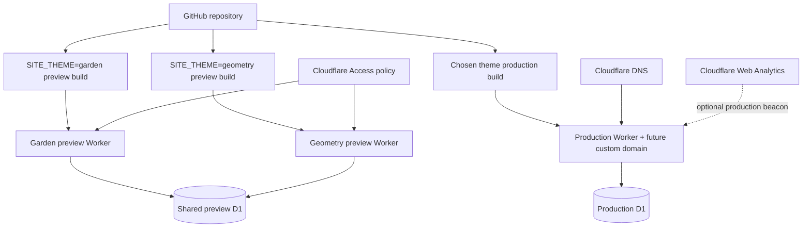

# Cloudflare infrastructure

- Status: Configuration implemented; account resources not provisioned
- Audience: Cloudflare administrators, DevOps maintainers and school owner
- Owner: Infrastructure maintainer
- Last updated: 2026-08-30

## Deployment topology

## Resources

- Two preview Worker environments: `garden` and `geometry`.
- One shared preview D1 database with binding `DB`.
- One future production Worker and separate production D1 database.
- Workers Static Assets for compiled CSS and browser code.
- Cloudflare Access application/policies covering `/admin*` and `/api/admin*` on every hostname.
- Cloudflare DNS and Web Analytics only after a domain is chosen.

Astro sessions are explicitly disabled because the application has no session state, avoiding an unnecessary KV namespace. Image handling is set to passthrough because version one ships no photographic assets, avoiding an unnecessary Cloudflare Images binding.

## Configuration safety

[`wrangler.jsonc`](../wrangler.jsonc) contains a visible placeholder instead of a real D1 ID. Cloudflare account IDs, API tokens, private email allowlists, Access secrets and analytics tokens must remain in Cloudflare or CI secrets. Environment-specific D1 bindings must be added during provisioning.

## Provisioning sequence

1. Authenticate Wrangler on the owner’s Cloudflare account.
2. Create preview and production D1 databases.
3. Replace placeholders or inject generated configuration without committing sensitive account metadata.
4. Apply migrations locally, then to preview and production.
5. Configure Access before exposing admin routes.
6. Deploy both preview themes with preview indexing disabled.
7. After selection, deploy only the chosen theme to production and attach the domain.

Use the current [Astro Workers guide](https://developers.cloudflare.com/workers/framework-guides/web-apps/astro/) and [D1 Worker API](https://developers.cloudflare.com/d1/worker-api/) during provisioning because platform syntax and limits can change.
