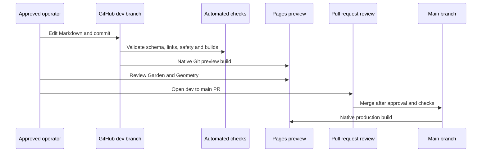
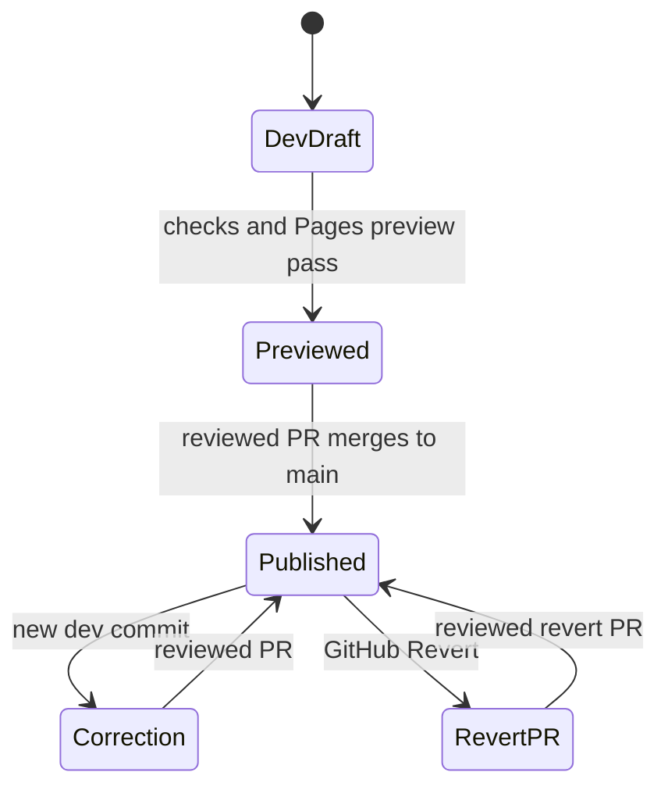

# GitHub content workflow

- Status: Repository workflow implemented; branch protection and Pages previews pending remote setup
- Audience: School operators, approvers and maintainers
- Owner: School content owner
- Last updated: 2026-08-31

The filename is retained for historical links; there is no custom admin application. GitHub is the editing, identity, review and audit surface.

## Draft, preview and publish lifecycle

## Permissions and boundaries

Operators may edit school facts and Markdown articles. They may select one approved illustration name. They may not add photographs, HTML, scripts, navigation, layout tokens, deployment settings or credentials. Main branch protection requires pull requests and passing checks.

## Revision and rollback

Git commits are immutable history for normal operations. Rollback creates a new revert commit through a pull request; never force-push or rewrite `main`. See the [operator guide](21-content-operator-guide.md).
