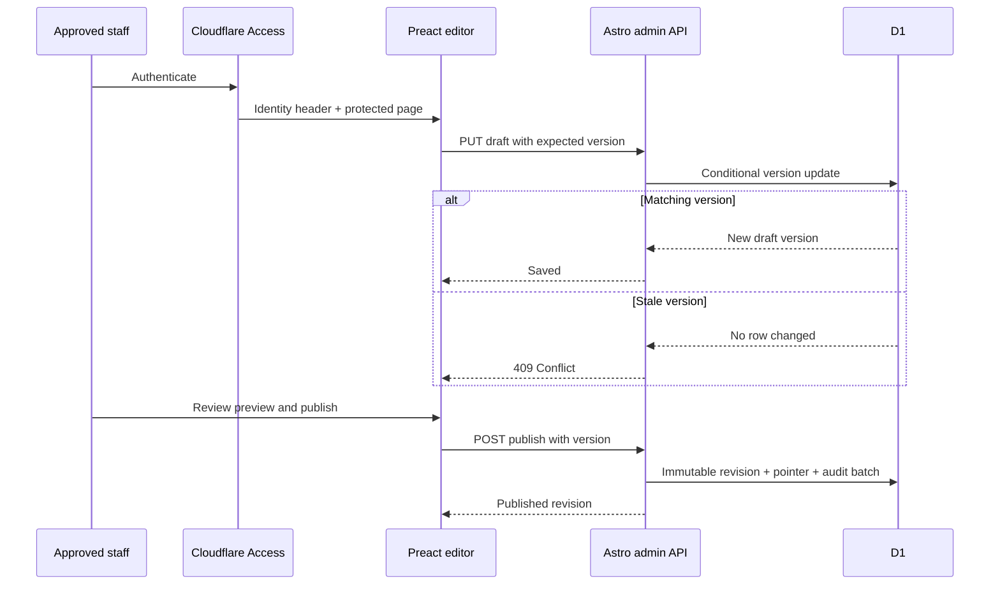

# Admin content workflow

- Status: Implemented baseline
- Audience: Approved school staff, operators and developers
- Owner: School content owner
- Last updated: 2026-08-30

## Lifecycle

## Allowed editing

The editor exposes contact details, homepage hero, SEO defaults and the four programme records. The schema also supports bounded pages and announcements for future editor controls without changing the database format.

## Restricted editing

Staff cannot upload media, insert HTML, add scripts, change route/navigation structure, edit layout tokens, select a deployment theme, change Access policy or alter infrastructure. These restrictions are enforced by the UI, strict schema and absence of any upload/API surface.

## Preview and publish

Save creates a new draft version. Preview opens a public-style rendering target; production implementation should extend request handling to select the protected draft only when Access identity is present. Until that enhancement is enabled, editors verify text in the bounded fields and publish to view it publicly on a noindex preview Worker. Publish creates an immutable revision.

## Rollback

Restore copies an immutable revision into a new draft version. Staff must review and explicitly publish it. This preserves auditability and avoids an accidental one-click live rollback.
