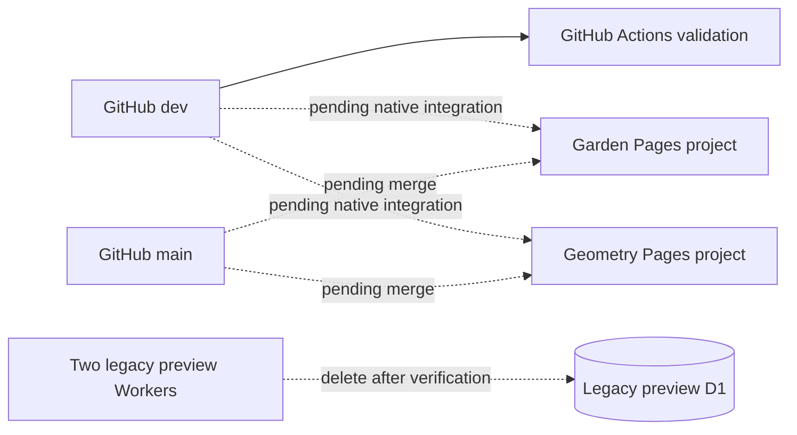

# Integrations and deployment record

- Status: Static code pushed to `dev`; remote Pages/branch setup and legacy deletion pending
- Audience: Repository administrators, Cloudflare operators and maintainers
- Owner: Integration maintainer
- Last updated: 2026-08-31

## Current topology record

## Repository integration

- Remote: `https://github.com/firststepmontessori/firststepmontessori.git`.
- Development branch: `dev`; production branch: `main`.
- Workflow: `.github/workflows/ci-cd.yml`, validation only.
- Deployment credentials: not required after Pages Git integration; obsolete secrets must be removed during cutover.
- Local Git push remains functional, but the GitHub CLI token was expired at migration start; PR and protection setup require reauthentication.

## Cloudflare target resources

| Resource | Intended state |
|---|---|
| Pages `first-step-montessori-garden` | Create through native Git integration |
| Pages `first-step-montessori-geometry` | Create through native Git integration |
| Worker `first-step-montessori-garden-preview` | Delete after Pages acceptance |
| Worker `first-step-montessori-geometry-preview` | Delete after Pages acceptance |
| D1 `first-step-montessori-preview` | Export then delete after Worker deletion |
| Additional `first-step-montessori` Worker | Inventory and delete only if confirmed obsolete |

The local Cloudflare OAuth token was expired on 2026-08-31, so account inventory, D1 export, Pages creation and deletion remain pending fresh authorization. Never infer deletion targets from names alone; resolve account inventory first.

## Pages build configuration

Both projects connect to `firststepmontessori/firststepmontessori`, build `main`, preview `dev`, run `npm run build` and publish `dist`. Set `SITE_THEME` per project; set production and preview `SITE_ENV`/`PUBLIC_SITE_URL` separately. No deploy hook, Wrangler command or API token is used.

## Evidence to append after provisioning

- Pages project IDs and public `pages.dev` URLs (IDs are non-secret but avoid account IDs).
- Successful main/dev build links and commit SHA.
- HTTP status, robots, canonical, headers, RSS and 404 verification.
- D1 export filename/location confirmation without sensitive contents.
- Exact Worker/D1 deletion time and verification that resources are absent.
- GitHub secret removal and branch-protection confirmation.

## Domain handover

After theme approval, record the chosen project, custom domain, DNS status, canonical rebuild, Search Console/Business Profile ownership and unselected-project retirement. Do not record registrar passwords, recovery codes or tokens.
