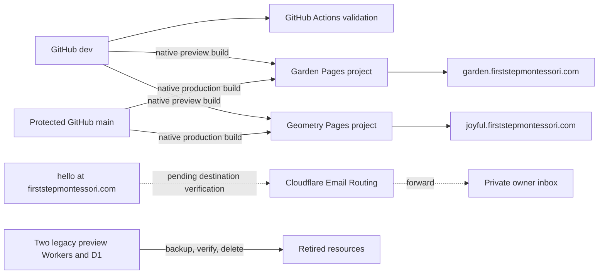

# Integrations and deployment record

- Status: Pages, repository, theme-domain and mail-DNS integrations verified; legacy runtime retired; email rule pending
- Audience: Repository administrators, Cloudflare operators and maintainers
- Owner: Integration maintainer
- Last updated: 2026-08-31

## Current topology record

## Repository integration

- Remote: `https://github.com/firststepmontessori/firststepmontessori.git`.
- Development branch: `dev`; production branch: `main`.
- Workflow: `.github/workflows/ci-cd.yml`, validation only.
- Deployment credentials: none; Pages uses its repository-scoped GitHub App installation.
- `main` requires a pull request, the `Validate website and documentation` check, an up-to-date branch and resolved review conversations. Independent approval is not required because the organization currently has one member.
- PR #3 merged the static migration at commit `a458ffd` through the protected branch workflow.

## Cloudflare target resources

| Resource | Intended state |
|---|---|
| Pages `first-step-montessori-garden` | Live at `https://garden.firststepmontessori.com`; Pages fallback retained |
| Pages `first-step-montessori-geometry` | Live at `https://joyful.firststepmontessori.com`; Pages fallback retained |
| Email Routing | Domain enabled with MX/SPF/DKIM records; owner-confirmed Gmail destination added and Pending verification; zero routing rules |
| Worker `first-step-montessori-garden-preview` | Deleted 2026-08-31; former URL returns 404 |
| Worker `first-step-montessori-geometry-preview` | Deleted 2026-08-31; former URL returns 404 |
| D1 `first-step-montessori-preview` | Full export verified, then deleted 2026-08-31; final inventory empty |
| GitHub Actions deployment secrets | None at repository, environment or organization scope |

Fresh browser and Wrangler authorization completed on 2026-08-31. The GitHub App was restricted to the website repository, both exact Pages projects were created, and the final inventory resolved only the two project Workers and their D1 binding. No other Worker was deleted.

## Pages build configuration

Both projects connect to `firststepmontessori/firststepmontessori`, build `main`, preview only `dev`, run `npm run build` and publish `dist`. Garden uses `SITE_THEME=garden`; Geometry uses `SITE_THEME=geometry`. Both showcase production environments use `SITE_ENV=preview` and their matching custom subdomain as `PUBLIC_SITE_URL`, keeping them noindex until selection. No deploy hook, Wrangler command, Pages Function, binding or API token is used.

## Verification evidence

- Initial native production builds for both themes succeeded from merge commit `a458ffd`.
- Every public HTML route, `robots.txt`, `sitemap.xml` and `/blog/rss.xml` returned the expected status and content type on both origins.
- Unknown routes returned HTTP 404 with the custom First Step Montessori page.
- Both origins emitted `noindex,nofollow`; preview robots disallow crawling and the preview sitemap is intentionally disabled.
- Garden and Geometry reported their correct compile-time theme identity while sharing content and behaviour.
- System/Light/Night controls worked live; the explicit Night choice persisted across reload and returning to System restored device-following behaviour.
- Security headers were present, including HSTS, CSP, Permissions Policy, Referrer Policy, nosniff and frame denial.
- Static output contains no Pages Function/Worker entrypoint, runtime binding or upload endpoint.
- On 2026-08-31, both custom subdomains became Active with SSL. Home and `/blog/` returned HTTP 200 on both.
- On 2026-08-31, Email Routing was activated for the apex domain and Cloudflare reported its DNS records Enabled. No routing rule was created and no private destination was recorded in GitHub.
- On 2026-08-31, the owner-confirmed destination was added to Cloudflare and a verification message was sent. The destination remained Pending at handoff, so `hello@firststepmontessori.com` was not yet created.
- The supplied Google Maps short link was verified to open Street View at the school coordinates and was added to the shared site content. Street View remains an external link rather than an embedded photographic surface.
- The final Worker binding inspection exposed the D1 resource omitted by the earlier account-level list view. The full export is `.local-backups/first-step-montessori-preview-20260831T091340Z.sql`, intentionally excluded from Git; its SHA-256 is `75f1d0135bd109bbabadcf36fdc86c34db54794aeac1dc23b18c646c4bbceab0`.
- The backup contains the `d1_migrations`, `site_drafts`, `site_revisions` and `audit_log` schemas and zero content-row inserts.
- Wrangler confirmed both exact Worker deletions and the exact D1 deletion. A final D1 list returned `[]`; both former Worker URLs returned HTTP 404.

## Domain handover

After theme approval, record the chosen project, apex/`www` DNS status, production canonical rebuild, Search Console/Business Profile ownership and unselected-project retirement. Do not record registrar passwords, recovery codes, private forwarding destinations or tokens.
