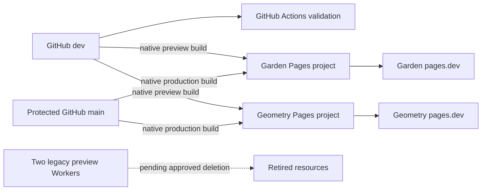

# Integrations and deployment record

- Status: Pages and repository integrations verified; legacy Worker deletion pending explicit approval
- Audience: Repository administrators, Cloudflare operators and maintainers
- Owner: Integration maintainer
- Last updated: 2026-08-31

## Current topology record

## Repository integration

- Remote: `https://github.com/firststepmontessori/firststepmontessori.git`.
- Development branch: `dev`; production branch: `main`.
- Workflow: `.github/workflows/ci-cd.yml`, validation only.
- Deployment credentials: none; Pages uses its repository-scoped GitHub App installation.
- `main` requires a pull request, the `Validate website and documentation` check, an up-to-date branch and resolved review conversations. Independent approval is not required because the organization currently has one member.
- PR #3 merged the static migration at commit `a458ffd` through the protected branch workflow.

## Cloudflare target resources

| Resource | Intended state |
|---|---|
| Pages `first-step-montessori-garden` | Live and verified at `https://first-step-montessori-garden.pages.dev` |
| Pages `first-step-montessori-geometry` | Live and verified at `https://first-step-montessori-geometry.pages.dev` |
| Worker `first-step-montessori-garden-preview` | Confirmed legacy; pending explicit deletion approval |
| Worker `first-step-montessori-geometry-preview` | Confirmed legacy; pending explicit deletion approval |
| D1 databases | Inventory returned zero databases; no action applicable |
| GitHub Actions deployment secrets | None at repository, environment or organization scope |

Fresh browser authorization completed on 2026-08-31. The GitHub App was restricted to the website repository, both exact Pages projects were created, and the account inventory resolved the two legacy Workers. No additional Worker is authorized for deletion.

## Pages build configuration

Both projects connect to `firststepmontessori/firststepmontessori`, build `main`, preview only `dev`, run `npm run build` and publish `dist`. Garden uses `SITE_THEME=garden`; Geometry uses `SITE_THEME=geometry`. Both showcase production environments use `SITE_ENV=preview` and their own `PUBLIC_SITE_URL`, keeping them noindex until selection. No deploy hook, Wrangler command, Pages Function, binding or API token is used.

## Verification evidence

- Initial native production builds for both themes succeeded from merge commit `a458ffd`.
- Every public HTML route, `robots.txt`, `sitemap.xml` and `/blog/rss.xml` returned the expected status and content type on both origins.
- Unknown routes returned HTTP 404 with the custom First Step Montessori page.
- Both origins emitted `noindex,nofollow`; preview robots disallow crawling and the preview sitemap is intentionally disabled.
- Garden and Geometry reported their correct compile-time theme identity while sharing content and behaviour.
- System/Light/Night controls worked live; the explicit Night choice persisted across reload and returning to System restored device-following behaviour.
- Security headers were present, including HSTS, CSP, Permissions Policy, Referrer Policy, nosniff and frame denial.
- Static output contains no Pages Function/Worker entrypoint, runtime binding or upload endpoint.
- Exact Worker deletion time and absence verification must be appended after separate destructive-action approval.

## Domain handover

After theme approval, record the chosen project, custom domain, DNS status, canonical rebuild, Search Console/Business Profile ownership and unselected-project retirement. Do not record registrar passwords, recovery codes or tokens.
