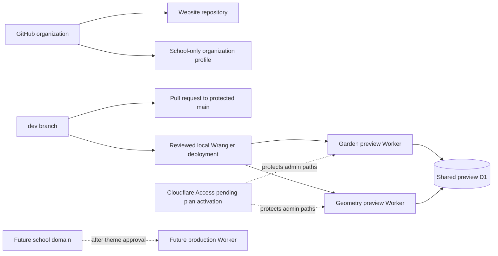

# Integrations and deployment record

- Status: Preview integration operational; Access and production automation pending
- Audience: Repository maintainers, Cloudflare operators and school owners
- Owner: Infrastructure maintainer
- Last updated: 2026-08-30

## Purpose

This document records the real GitHub and Cloudflare integration state, the
commands used to reproduce it and the boundaries that must remain outside
version control. It deliberately omits Cloudflare account IDs, OAuth/API tokens,
private email allowlists and recovery credentials.

## Connected services



## Resource inventory

| Service | Resource | State |
|---|---|---|
| GitHub | [`firststepmontessori/firststepmontessori`](https://github.com/firststepmontessori/firststepmontessori) | Public; development on `dev`; PR-only `main` |
| GitHub | [`firststepmontessori/.github`](https://github.com/firststepmontessori/.github) | Public school profile; PR-only `main` |
| Cloudflare Workers | `first-step-montessori-garden-preview` | Deployed and returning HTTP 200 |
| Cloudflare Workers | `first-step-montessori-geometry-preview` | Deployed and returning HTTP 200 |
| Cloudflare D1 | `first-step-montessori-preview` | APAC; shared `DB` binding; migration `0001_content.sql` applied |
| Cloudflare Access | Preview admin applications | Pending Zero Trust plan activation and private allowlist approval |
| Cloudflare DNS | Final school domain | Not selected |
| Cloudflare Web Analytics | Production analytics | Not configured |
| GitHub–Cloudflare builds | Cloudflare GitHub App | Not installed; deployments are currently manual and reviewed |

## Live endpoints

- Garden: <https://first-step-montessori-garden-preview.harshu-1982.workers.dev>
- Geometry: <https://first-step-montessori-geometry-preview.harshu-1982.workers.dev>

These are design-review previews, not separate school identities. Both are
`noindex,nofollow`, return a crawl-blocking `robots.txt` and use identical
content and data. They must remain non-indexable after every deployment.

## GitHub workflow

All implementation changes are committed to `dev`. `main` rejects direct and
force pushes, disallows deletion and accepts changes only through a pull
request. Each implementation phase or operational correction receives a focused
commit and is pushed to `dev`; successful validation is recorded in the PR.

The organization `.github` repository contains a school-only public profile.
Its visible README must describe the school as an early-childhood education
centre and must not discuss the website framework, hosting or design process.

## Cloudflare authentication

Use the official Wrangler OAuth flow on the operator's machine:

```bash
npx wrangler login
npx wrangler whoami
```

The resulting local OAuth credential must never be copied into Git, Markdown,
chat, CI variables or handover documents. Each operator authenticates with
their own authorized identity. Logout or revoke the credential when the machine
is no longer trusted.

## D1 provisioning and migration

The preview database was created with an APAC location hint. For a new account,
the reproducible sequence is:

```bash
npx wrangler d1 create first-step-montessori-preview --location apac
npm run db:migrate:preview
```

Record the returned non-secret database resource identifier only in the D1
binding inside `wrangler.jsonc`. Do not record the Cloudflare account ID or an
API token. Confirm the remote tables after migration:

```bash
npx wrangler d1 execute first-step-montessori-preview --remote \
  --command "SELECT name FROM sqlite_master WHERE type='table' ORDER BY name;"
```

## Worker build and deployment

Run previews sequentially:

```bash
npm ci
npm run validate
npm run deploy:previews
```

`deploy:garden` and `deploy:geometry` set distinct canonical preview origins,
compile distinct `SITE_THEME` values, keep `SITE_ENV=preview`, select the shared
D1 environment and pass an explicit Worker `--name`.

The explicit names are mandatory. Astro writes `dist/server/wrangler.json` and
Wrangler reports that it is using this redirected configuration. During initial
provisioning, commands relying only on `--env garden` and `--env geometry`
targeted the same top-level Worker. The scripts were corrected, both named
previews were deployed and verified, and the accidental top-level Worker was
deleted without removing D1.

## Verification record

Verified on 2026-08-30:

- both roots return HTTP 200;
- rendered `data-site-theme` is `garden` and `geometry` respectively;
- both canonical URLs match their deployed Worker origins;
- both pages emit `noindex,nofollow`;
- preview `robots.txt` disallows all crawling;
- Light mode changes the rendered state and persists after reload;
- unauthenticated `/admin` returns HTTP 401 with `no-store` and noindex headers;
- forged Access identity headers also return HTTP 401;
- `site_drafts`, `site_revisions` and `audit_log` exist in remote D1;
- no application-origin console errors were observed during live browser checks.

## Access activation still required

The account's Zero Trust area reports that an active plan must be selected
before Access applications can be created. The account owner must approve that
plan activation and the private identity allowlist. After approval:

1. create Access applications for `/admin*` and `/api/admin*` on both preview
   hostnames;
2. allow only named school/maintainer identities;
3. verify an unauthenticated request redirects to Access rather than reaching
   the Worker;
4. verify an approved identity can load the editor and execute draft/publish/
   rollback flows;
5. keep identities and policy identifiers out of Git.

## Optional automatic builds

There is no Cloudflare GitHub App installation today. Manual Wrangler deploys
preserve explicit review and avoid granting repository access to another app.
If automatic builds are approved later, record the GitHub App scope, selected
repository, branch triggers, build command, deploy command, secrets ownership,
failure notifications and rollback procedure here before enabling it.

## Production remains intentionally separate

Do not reuse the preview D1 database or either preview Worker as production.
After the school verifies content, chooses a theme and selects a domain, create
a production D1 database, deploy only the chosen theme with `SITE_ENV=production`,
attach DNS, configure Access, enable the agreed privacy-preserving analytics and
complete Search Console/Business Profile ownership.
