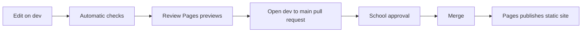

# Content operator guide

- Status: Implemented for GitHub-managed static publishing
- Audience: School owners, approved content editors and reviewers
- Owner: School content owner
- Last updated: 2026-08-31

## The simple publishing rule

The website publishes only what reaches the `main` branch through an approved pull request. Work is prepared on `dev`, where Cloudflare provides a preview that search engines are instructed not to index.

## Update school information

1. Sign in to GitHub and open the `firststepmontessori/firststepmontessori` repository.
2. Select the `dev` branch.
3. Open `src/content/site/school.md` and choose the pencil-shaped edit action.
4. Change only the required value after checking it with the school.
5. Use the preview panel to check spacing and punctuation.
6. Commit directly to `dev` with a short message such as `content: update daycare hours`.
7. Wait for checks and the two theme previews.
8. Open a pull request from `dev` to `main`, complete the checklist and request review.

Do not change the indentation of nested fields. Phone, WhatsApp and date values should remain inside quotation marks when the template shows quotation marks.

## Add a journal article

1. Copy `templates/blog-post.md` into `src/content/blog/`.
2. Rename it to the permanent slug, for example `helping-children-build-independence.md`.
3. Make the frontmatter `slug` exactly match the filename.
4. Write the article below the second `---` line using headings, paragraphs, lists and ordinary links.
5. Keep `draft: true` until the wording and sources are ready.
6. Change it to `draft: false` on `dev` to include it in the theme previews.
7. Complete the same pull-request review process used for school information.

Article Markdown cannot contain raw HTML or image syntax. Choose one of the approved illustration names instead. Photographs and child information are not allowed.

## Correct or withdraw an article

- Small correction: edit the existing file, add `updatedDate`, and publish through a pull request.
- Temporary withdrawal: set `draft: true` and publish the change.
- URL correction: keep the old slug unless it is unsafe or materially wrong. If it must change, add an old-to-new rule in `public/_redirects`.

## Roll back a published change

Open the merged pull request in GitHub and choose **Revert**. Review the generated revert pull request, confirm its preview, and merge it. Do not rewrite branch history or force-push.

## What must never be committed

- Child or parent names, photographs, videos or consent records.
- Passwords, API tokens, account identifiers or private allowlists.
- Unverified accreditation, founder-employment or outcome claims.
- Fees, seat availability or operating hours that the school has not approved.

Use the [content verification checklist](18-content-verification-checklist.md) before publication.
