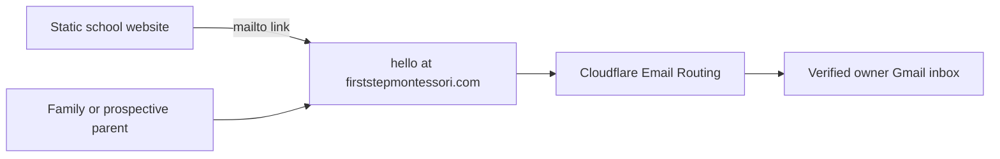

# Domain email routing

- Status: Domain MX/SPF/DKIM enabled; public rule, owner destination and verification pending
- Audience: School owner, domain administrator and maintainers
- Owner: Domain and email administrator
- Last updated: 2026-08-31

## Decision

Use `hello@firststepmontessori.com` as the primary public address. It is warm, simple to say and suitable for admissions, visits, accessibility and general family questions. An optional `admissions@firststepmontessori.com` alias may forward to the same inbox later if the school wants a more explicit address.

Cloudflare Email Routing will accept inbound mail for the public alias and forward it to one verified, owner-managed Gmail inbox. The destination address is private operational data: store it only in Cloudflare, never in this repository, public pages, screenshots or documentation.

## Connection

Cloudflare DNS supplies the required MX and sender-policy records. Email Routing performs forwarding only and does not add a Worker, Pages Function, D1 database or application runtime. Cloudflare currently documents Email Routing as free and unlimited on Free and Paid plans; operators must still review current platform terms before a future migration.

## Activation runbook

1. Obtain the exact Gmail destination directly from the owner; do not infer it from a Cloudflare or GitHub account.
2. Confirm that activating Cloudflare MX records will not displace an existing mail provider.
3. **Complete (2026-08-31):** Enable Email Routing for `firststepmontessori.com` and allow Cloudflare to add the required DNS records.
4. Add the destination address and ask the owner to click Cloudflare’s verification link.
5. Create `hello@firststepmontessori.com` only after the destination reports Verified.
6. Send an external test message and confirm receipt, sender, subject, body and attachments.
7. Replace the temporary Gmail address in `src/content/site/school.md` with the public alias, validate both themes, and publish through a `dev` to `main` pull request.
8. Test the website mail links and record only the date and pass/fail result in the integration record.

Current Cloudflare state: the domain is onboarded, DNS records are Enabled, and there are zero routing rules. The next action requires the exact owner-approved Gmail destination and completion of Cloudflare's verification message.

## Sending replies

Email Routing does not provide an outbound mailbox. A normal Gmail reply may expose the destination Gmail address unless Gmail is separately configured and verified to send as `hello@firststepmontessori.com`. Before enabling send-as, choose an outbound provider appropriate for a school, require multi-factor authentication, configure SPF/DKIM/DMARC, and test reply identity and deliverability. Google Workspace is the simplest long-term choice if the school later needs staff mailboxes, calendars, administration and reliable domain-branded sending; it is a paid service and is not required for the free inbound-forwarding phase.

## Safety and ownership

- Enable multi-factor authentication on Cloudflare, the destination Gmail account and any future outbound provider.
- Keep recovery codes and credentials with the school/donor owner, not in GitHub.
- Avoid catch-all routing; explicit aliases reduce unwanted mail and mistakes.
- Use a school-controlled inbox instead of a volunteer’s personal mailbox when operational ownership is ready to transfer.
- Reconfirm the destination and recovery owner during handover and at least once per school year.

Sources: [Cloudflare Email Routing setup](https://developers.cloudflare.com/email-service/get-started/route-emails/), [routing addresses](https://developers.cloudflare.com/email-service/configuration/email-routing-addresses/), [domain requirements](https://developers.cloudflare.com/email-service/configuration/domains/) and [pricing](https://developers.cloudflare.com/email-service/platform/pricing/).
